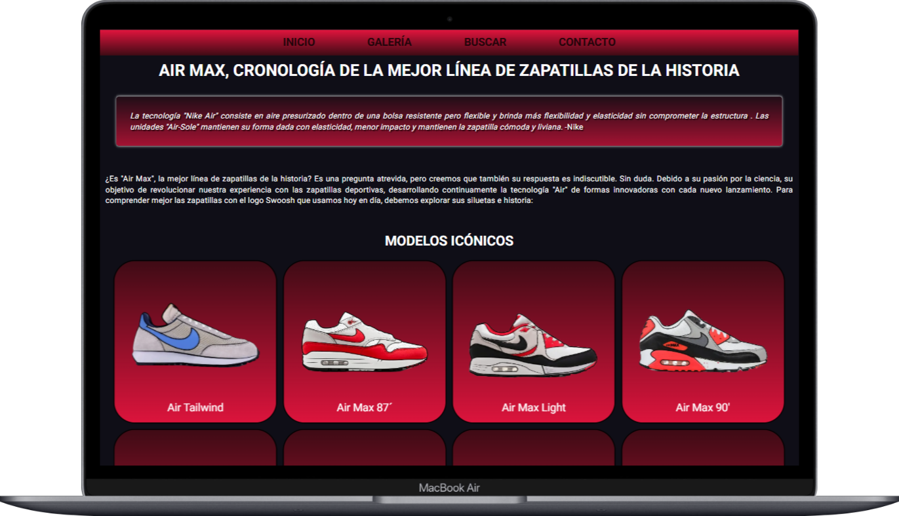

# 👟 Historia de las Air Max: Diseño, Cultura y Moda

Este proyecto es una **página web informativa** hecha con **HTML5** y **CSS3**, que narra la evolución de las zapatillas **Nike Air Max** desde su origen hasta sus modelos más icónicos.

---
  

## 🌐 Descripción

La web está pensada como una cronología visual e interactiva de los modelos **Air Max más emblemáticos**, con énfasis en su diseño, historia, influencias culturales y evolución tecnológica.

Incluye:

- 🖼️ Galería interactiva con tarjetas de modelos Air Max (con efecto "flip")
- 📜 Citas y referencias históricas
- 📹 Entrevista embebida a Tinker Hatfield (YouTube)
- 📬 Formulario de suscripción a newsletter
- 🎨 Diseño responsive y limpio

---

## 🧑‍💻 Tecnologías utilizadas

- ✅ HTML5
- ✅ CSS3

> No se han utilizado frameworks ni JavaScript: todo está hecho a mano.

## ✨ Características destacadas

📌 Diseño limpio y adaptable

🔁 Tarjetas flip para mostrar información al pasar el ratón

📝 Formulario de registro simulado

🧠 Contenido histórico y cultural

📺 Vídeo incrustado de YouTube

---
## 📜 Créditos
Imágenes y contenido original sobre modelos Air Max

Entrevista a Tinker Hatfield: YouTube
---
## 📄 Licencia
Este proyecto es de uso educativo y no comercial. Las imágenes son usadas con fines ilustrativos.
